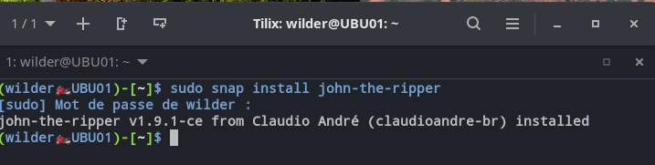
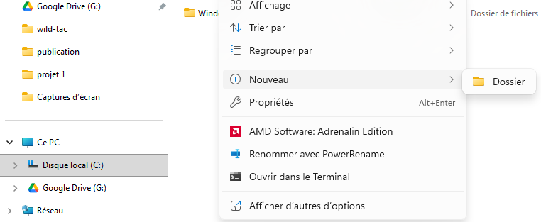
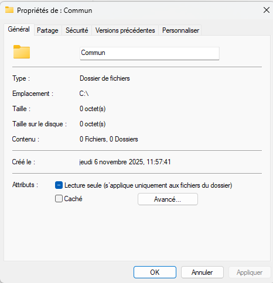
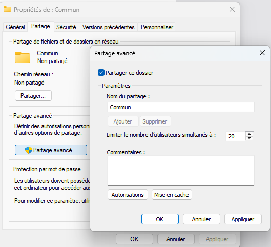
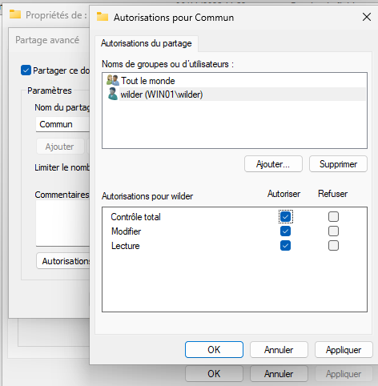
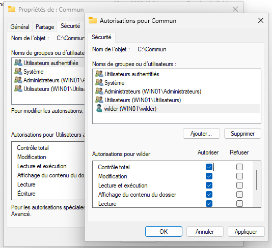
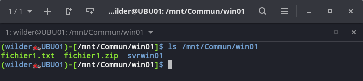

## Sommaire

1. [Prérequis technique](#1-prérequis-techniques)
2. [Installation sur le serveur Linux (Debian 13.1.0)](#2-installation-sur-le-serveur-debian-1310)
3. [Installation sur le client Linux (Ubuntu 24.04 LTS)](#3-installation-sur-le-client-ubuntu-2404-lts)
4. [Installation sur les machines cibles (Windows 11 Professionnel & Windows Server 2019)](#4-installation-sur-les-machines-cibles-windows-11-professionnel--windows-server-2019)
5. [FAQ](#5-faq)

## 1. Prérequis techniques
<span id="presentation-du-projet"></span>
## 2. Installation sur le serveur (Debian 13.1.0)
<span id="installation-sur-le-serveur-debian1310"></span>
### 2.1 Préparation de l'environnement
<span id="presentation-du-projet"></span>

Mettre à jour le système :
```bash
sudo apt update && sudo apt upgrade -y
```

Créer un répertoire de travail dédié :
```bash
sudo mkdir -p /opt/audit
cd /opt/audit
```

---

### 2.2 Installation rapide

Pour une installation en une seule ligne de commande, sinon effectuer l'installation détaillée :
```bash
sudo apt install -y git p7zip-full unzip zipinfo hashcat
```
---
Ensuite, installer zip2haschat :
```bash
cd /opt
```

```bash
sudo wget https://github.com/hashstation/zip2hashcat/archive/refs/tags/1.0.zip
```

```bash
sudo mv zip2hashcat /usr/local/bin/
```

```bash
sudo chmod +x /usr/local/bin/zip2hashcat
```
---
### 2.3 Installation détaillée
##### 2.3.1 Git

```bash
sudo apt install -y git
```
Commandes utiles :
```bash
git --version
git clone <lien_URL>
```
---
##### 2.3.2 p7zip-full

```bash
sudo apt install -y p7zip-full
```

Commandes utiles :
```bash
7z l fichier.7z            # liste le contenu
7z x fichier.7z            # extrait les fichiers
7z l -slt fichier.7z       # détaille le chiffrement (AES, CRC, etc.)
```
---
##### 2.3.3 unzip

```bash
sudo apt install -y unzip
```

Commandes utiles
```bash
unzip -l fichier.zip       # liste le contenu
unzip fichier.zip          # extrait le contenu
```
---
##### 2.3.4 zipinfo

```bash
sudo apt install -y zipinfo
```

Commandes utiles :
```bash
zipinfo archive.zip          # affiche le contenu de l'archive
zipinfo -v archive.zip       # affiche le contenu détaillé de l'archive
```
---
##### 2.3.5 Hashcat 

```bash
sudo apt install -y hashcat
```

Vérifier l'installation :
```bash
hashcat --version
```
---
##### 2.3.6 zip2hashcat 

```bash
cd /opt
```

```bash
sudo wget https://github.com/hashstation/zip2hashcat/archive/refs/tags/1.0.zip
```

```bash
sudo mv zip2hashcat /usr/local/bin/
```

```bash
sudo chmod +x /usr/local/bin/zip2hashcat
```
---
## 3. Installation sur le client (Ubuntu 24.04 LTS)
<span id="installation-sur-le-client-ubuntu2404-lts"></span>
### 3.1 John the Ripper

 1. Pour l'installation de **John the Ripper**, saisir la commande suivante :
```bash
sudo snap install john-the-ripper
```
>	Cette méthode a le mérite d'installer une version récente et embarque davantage de bibliothèque, également plus de format supporté . Les mises à jour sont automatique.

---
Une fois la commande exécuté vous devriez avoir ce message :


---
2. Si la commande **snap** ne fonctionne pas, c'est parce que le paquet snap n'est pas installé sur votre distribution *Linux*, saisir la commande suivante :
```bash
sudo apt install snap
```
> Une fois le paquet snap installé reporté vous à la section 3.1.1 pour installé le logiciel *John the ripper*.

---
3. Il faut télécharger une wordlist plus conséquente pour utiliser **John the Ripper**, saisir la commande suivante :
```bash
sudo snap install seclists
```


Une fois *seclists* installé il faut aller chercher les listes de dictionnaire que nous avons besoins, nous en avons sélectionné deux :

1. La liste "000webhost.txt" :
```bash
cp /snap/seclists/1214/Passwords/Leaked-Databases/000webhost.txt ~/Documents/000webhost.txt
```

2. La liste "rockyou.txt" :
```bash
cp /snap/seclists/1214/Passwords/Leaked-Databases/rockyou.txt.tar.gz ~/Documents/rockyou.txt.tar.gz
```

---
Comme vous le voyez le fichier est compressé voici la commande pour le décompresser :
```bash
tar -xzf rockyou.txt.tar.gz 
```

---
### 3.2 Point de montage répertoire entre Windows et Linux
##### 3.2.1 Installer Samba et ses paquets sur votre distribution Linux

```bash
sudo apt install samba
```

Installation du paquet **cifs-utils** (prise en charge du Samba sous Linux)
```bash
sudo apt install cifs-utils -y
```

---
Activer le service, ainsi il va démarrer automatiquement au démarrage de la machine avec cette commande :
```bash
sudo systemctl enable smbd
```
---
##### 3.2.2 Création du dossier partagé sur Windows 11 Professional

Pour ce projet on va créé un dossier **C:\Commun**
On commence par créé le dossier à partir de l'Explorateur de fichiers:
Clic droit **Nouveau > Dossier.


---
Pour partagé le dossier suivons les étapes suivantes :	
Faire un clic droit sur le dossier **Commun**, puis sélectionnez **Propriété**


---
Cliquez sur l'onglet **Partage**, puis **Partage avancé** et enfin cochez la case **Partage ce dossier**. Conservez le nom par défaut.


---
Cliquez sur **Autorisation** 
Veuillez à ajouter l'utilisateur qui doit avoir accès au partage, en lui donnant les autorisations de **Contrôle total**.


---
Dernière manipulation sur **Windows** cliquez sur l'onglet **Sécurité**.Ajoutez l'utilisateur également ici et lui octroyer également toutes les autorisations à cet endroit.


##### 3.2.3 Création du dossier partagé sur Windows Server 2019

Effectuer la même procédure que l'étape 3.2.2

---
##### 3.2.4 Création du dossier partagé sur Linux

Création des dossiers commun :
```bash
sudo mkdir /mnt/Commun/win01
```

```bash
sudo mkdir /mnt/Commun/win01/svrwin01
```

---
##### 3.2.5 Monter le partage dans le système de fichier dans Linux

Monter le partage de notre dossier Commun de WIN01 :
```bash
sudo mount -t cifs //win01/Commun /mnt/Commun/win01 -o username=wilder
```
> 	Vous devez maintenant saisir votre mot de passe Windows.

---
Monter le partage de notre dossier Commun de SRVWIN01 :
```bash
sudo mount -t cifs //svrwin01/Commun /mnt/Commun/win01/svrwin01 -o username=wilder
```
> 	*Vous devez maintenant saisir votre mot de passe Windows.

---
Commande à exécuter pour lister le contenu de notre dossier Commun :
```bash
ls /mnt/Commun/win01/svrwin01
```



---
```bash
ls /mnt/Commun/win01
```
 

---
### 3.3 Le logiciel 7-Zip

##### 3.3.1 p7zip-full
```bash
sudo apt install -y p7zip-full
``` 

Commandes utiles :
```bash
7z l fichier.7z                   # liste le contenu
7z x fichier.7z                   # extrait les fichiers
7z l -slt fichier.7z              # détaille le chiffrement (AES, CRC, etc.)
7z e <archive>                    # Décompresse une archive
```
---
*un exemple de création en CLI*
![[creation_archive_ubuntu.jpg]]

---
*un exemple d' extraction en CLI*
![[extraction_archive_ubuntu.jpg]]

---
##### 3.3.2 unzip
```bash
sudo apt install -y unzip
```

Commandes utiles
```bash
unzip -l fichier.zip       # liste le contenu
unzip fichier.zip          # extrait le contenu
```
---
##### 3.3.3 zipinfo
```bash
sudo apt install -y zipinfo
```

Commandes utiles :
```bash
zipinfo archive.zip          # affiche le contenu de l'archive
zipinfo -v archive.zip       # affiche le contenu détaillé de l'archive
```
---
## 4. Installation sur les machines cibles (Windows 11 Professionnel & Windows Server 2019)
<span id="installation-sur-les-machines-cilbes-Window11Professionnel-&-Windows-Server2019"></span>
### 4.1 OpenSSH
#### 4.1.1 — Installation d'OpenSSH Server

##### Via l'interface graphique  pour Windows 11

1. **Ouvrir les Paramètres Windows**
    - Accédez à **Système** → **Fonctionnalités facultatives**
2. **Afficher ou modifier les fonctionnalités facultatives**
    - Cliquez sur **Afficher les fonctionnalités**
    - Recherchez **OpenSSH Server**
    - Cochez la case et cliquez sur **Installer**
    - Ne rien faire si cela affiche **Supprimer**
3. **Vérification de l'installation**
    
    ```powershell
    Get-WindowsCapability -Online | Where-Object Name -like 'OpenSSH.Server*'
    ```
    
    **Résultat attendu :**
    
    ```
    Name  : OpenSSH.Server~~~~0.0.1.0
    State : Installed
    ```
    

---
##### Via PowerShell Server 2019

**Lancer PowerShell en tant qu'administrateur** :

```powershell
# Installer OpenSSH Server
Add-WindowsCapability -Online -Name OpenSSH.Server~~~~0.0.1.0

# Vérifier l'installation
Get-Service sshd
```

**Résultat attendu :**

```
Status   Name               DisplayName
------   ----               -----------
Stopped  sshd               OpenSSH SSH Server
```

---
#### 4.1.2 — Configuration du service SSH
##### Démarrer et activer le service

```powershell
# Démarrer le service SSH
Start-Service sshd

# Configurer le démarrage automatique
Set-Service -Name sshd -StartupType 'Automatic'

# Vérifier le statut
Get-Service sshd
```

**Résultat attendu :**

```
Status   Name               DisplayName
------   ----               -----------
Running  sshd               OpenSSH SSH Server
```

---
##### Configurer ssh-agent (optionnel mais recommandé)
```powershell
# Démarrer ssh-agent
Start-Service ssh-agent

# Configurer le démarrage automatique
Set-Service -Name ssh-agent -StartupType 'Automatic'
```

---
#### 4.1.3 — Configuration du pare-feu Windows
##### Via PowerShell (recommandé)
```powershell
# Créer une règle de pare-feu pour SSH (port 22)
New-NetFirewallRule -Name 'OpenSSH-Server-In-TCP' `
                    -DisplayName 'OpenSSH Server (sshd)' `
                    -Enabled True `
                    -Direction Inbound `
                    -Protocol TCP `
                    -Action Allow `
                    -LocalPort 22 `
                    -Profile Any
```

**Vérification de la règle :**

```powershell
Get-NetFirewallRule -Name 'OpenSSH-Server-In-TCP' | Select-Object Name, Enabled, Direction, Action
```

---
##### Via l'interface graphique

1. **Ouvrir le Pare-feu Windows Defender**
    
    - Appuyez sur `Win + R`, tapez `wf.msc` et validez
2. **Créer une règle entrante**
    
    - Cliquez sur **Règles de trafic entrant** → **Nouvelle règle...**
    - Type : **Port**
    - Protocole : **TCP**
    - Port spécifique : **22**
    - Action : **Autoriser la connexion**
    - Profils : Cochez **Domaine**, **Privé**, **Public**
    - Nom : `SSH Entrant (Port 22)`

---
##### Test distant depuis Linux (Ubuntu/Debian)

**Sur la machine Linux :**
```bash
# Récupérer l'IP de la machine Windows
# (à exécuter sur Windows) : ipconfig

# Se connecter depuis Linux
ssh utilisateur@192.168.x.x

# Exemple avec un utilisateur spécifique
ssh Administrator@192.168.1.50
```

**Première connexion - Empreinte SSH :**

```bash
The authenticity of host '192.168.1.50 (192.168.1.50)' can't be established.
ECDSA key fingerprint is SHA256:xxxxxxxxxxxxxxxxxxxxx.
Are you sure you want to continue connecting (yes/no/[fingerprint])? yes
```

Tapez `yes` et entrez le mot de passe Windows.

---

##### Test de transfert de fichier (SCP)

**Depuis Linux vers Windows :**
```bash
# Envoyer un fichier vers Windows
scp /chemin/fichier.zip utilisateur@192.168.1.50:C:/Temp/

# Envoyer un dossier complet
scp -r /chemin/dossier/ utilisateur@192.168.1.50:C:/Temp/
```

**Depuis Windows vers Linux :**
```powershell
# Envoyer un fichier vers Linux
scp C:\Temp\fichier.zip user@192.168.1.100:/home/user/

# Récupérer un fichier depuis Linux
scp user@192.168.1.100:/home/user/rapport.txt C:\Temp\
```

---
#### 4.1.4 — Configuration de l'authentification par clé SSH (recommandé)
##### Générer une paire de clés sur Linux

```bash
ssh-keygen -t ed25519 -C "audit@entreprise.local"
```

**Options :**
- Emplacement : `/home/user/.ssh/id_ed25519` (par défaut)

---
##### Copier la clé publique vers Windows

```bash
ssh-copy-id utilisateur@192.168.1.50
```

---
##### Tester la connexion sans mot de passe

```bash
ssh utilisateur@192.168.1.50
```

Vous devriez vous connecter sans demande de mot de passe (ou avec la passphrase de votre clé si configurée).

---
#### 4.1.5 — Vérifications et dépannage
##### Vérifier que le service écoute sur le port 22

```powershell
netstat -an | findstr :22
```

**Résultat attendu :**

```
TCP    0.0.0.0:22             0.0.0.0:0              LISTENING
TCP    [::]:22                [::]:0                 LISTENING
```

---
### 4.2. Le logiciel 7-Zip

#### 4.2.1 Installation manuelle

Le site officiel : [https://www.7-zip.org](https://www.7-zip.org)
![[page de telechargement 7zip.png]](Ressources/page_de_telechargement_7zip.png)

1. Télécharge la version correspondant à ton système :
2. Exécute le fichier `.exe` téléchargé avec un clic droit → **Exécuter en tant qu’administrateur**.
3. Clique sur **Install**, puis sur **Close** une fois terminé.

 *7-Zip s’ajoute automatiquement au menu clic droit de l’Explorateur.*
 
---
#### 4.2.2 Installation via PowerShell

Si **Winget** est disponible (Windows Server 2022, 2025, ou si tu l’as ajouté manuellement) :

```
winget install 7zip.7zip
```
 *7-Zip s’ajoute automatiquement au menu clic droit de l’Explorateur.*
 
---
#### 4.2.3 Installation sur Ubuntu

````
sudo apt-get install p7zip
````
---
### 4.3. Le point de montage

## 5. FAQ
<span id="FAQ"></span>
### 5.1 Hashcat

**Q : Quelle est la différence entre John et Hashcat ?**

> John the Ripper : orienté CPU, flexible, supporte de nombreux formats.  
> Hashcat : orienté GPU, très performant, idéal pour gros volumes.

---

**Q : Comment convertir un ZIP en hachage pour Hashcat ?**

```bash
zip2hashcat fichier.zip > hash.txt
```

---

**Q : Quelle commande utiliser pour lancer une attaque dictionnaire ?**

```bash
hashcat -m 13600 hash.txt /usr/share/wordlists/rockyou.txt
```

---

**Q : Et pour une attaque par masque (brute-force) ?**

```bash
hashcat -m 13600 hash.txt -a 3 '?d?d?d?d'
```

---

**Q : Comment tester si ma carte graphique est reconnue ?**

```bash
hashcat -I
```

---

**Q : Où sont stockés les résultats ?**

> Par défaut, dans le répertoire où tu lances la commande, fichier `.potfile` (ex: `~/.hashcat/hashcat.potfile`).

### 5.2 John the Ripper

**Q : Peut on créer un montage automatique au démarrage ?** 

Pour éviter a chaque démarrage de votre machine de refaire les manipulations pour le montage des dossiers voici les étapes à effectuer :
```bash
sudo nano /etc/fstab
```

---
Une fois dans ce fichier nous allons ajouter ces deux lignes :
```
//win01/Commun /mnt/Commun/win01 cifs credentials=/etc/smb-partage-creds 0 0
//svrwin01/Commun /mnt/Commun/win01/svrwin01 cifs credentials=/etc/smb-partage
```
> *Ensuite , sauvegardez le fichier (**CTRL+0** puis **ENTER**) et quittez (**CTRL+X**)*

---
Maintenant, on va créé le fichier **/etc/smb-partage-creds**, il va nous servir à stocker les utilisateurs et mot de passe.
```
sudo nano /etc/smb-partage-creds
```

---
Dans ce fichier indiquez le nom d'utilisateur et le mot de passe de votre compte Windows comme ceci :
```
username=wilder
password=Azerty1*
```
> Ensuite on enregistre et on ferme le fichier.

---
Pour **éviter les accès non autorisés**,modifions les permissions sur ce fichier avec cette commande :
```
sudo chmod 600 /etc/smb-partage-creds
```

---
### 5.3 Le logiciel 7-Zip

###### Q : À quoi sert le chiffrement d’un fichier ZIP ?

Le chiffrement d’un fichier ZIP consiste à le protéger par un mot de passe. Le contenu est brouillé à l’aide d’algorithmes cryptographiques et n’est accessible qu’en entrant le mot de passe correct. Cela empêche tout accès non autorisé, même si quelqu’un intercepte le fichier.

###### Q: Lequel est le meilleur, Zipcrypto ou AES-256  ? 

**Il est prouvé que le protocole AES-256 est beaucoup plus sûr que ZipCrypto** , mais si vous choisissez AES-256, le destinataire du fichier zip devra peut-être installer 7-zip ou un autre programme de compression pour lire le contenu du fichier.

###### Q: 7-Zip AES-256 est-il sûr  ? 

**Le format de fichier 7-Zip est sûr** . Le chiffrement AES-256 est sûr pour au moins les prochaines décennies, à condition d'utiliser un mot de passe robuste. Pensez à chiffrer les noms de fichiers si vous le souhaitez et à supprimer les fichiers de manière sécurisée après avoir vérifié l'archive. Si vous souhaitez un plus large choix d'algorithmes de chiffrement, essayez PicoCrypt. (12 mai 2023)

###### Q : Le chiffrement AES-256 est-il piratable  ?

**L'AES 256 est inviolable par force brute.**  Cela rend le chiffrement AES 256 et les données qui le protègent ensuite inviolables pour l'avenir imprévu. (22 juin 2022)

###### Q : Quelqu'un a-t-il déjà réussi à casser le chiffrement AES  ?

La différence entre le décryptage des algorithmes AES-128 et AES-256 est considérée comme minime. Toute avancée permettant de décrypter l'algorithme 128 bits permettra probablement aussi de décrypter l'algorithme 256 bits. En définitive, contrairement à certaines idées reçues, **l'AES n'a jamais été décrypté** et reste inviolable face aux attaques par force brute.

###### Q  : Quelles sont les risques et limites du chiffrement ZIP

- **Mots de passe faibles**: Évitez les mots de passe courts ou communs.
- **Fuites de métadonnées**: Certains outils ZIP peuvent révéler des noms de fichiers.
- **Compatibilité**: Tous les outils ne peuvent pas ouvrir les fichiers ZIP AES-256.
- **Pas de récupération**: Des mots de passe perdus signifient des fichiers perdus.

Pour éviter autant que possible ces risques, considérez les meilleures pratiques suivantes :

- Utilisez des [mots de passe forts et uniques](https://blog.mailfence.com/fr/mot-de-passe-ou-phrase-de-passe/) (12 caractères et plus).
- [Partagez les mots de passe](https://blog.mailfence.com/fr/partage-de-mot-de-passe-securise/) sur des canaux distincts (par exemple, courrier électronique + SMS).
- Vérifiez que le destinataire dispose d’outils compatibles (par exemple, 7-Zip ou WinRAR).
- Utilisez un hachage de fichier (SHA-256) pour confirmer l’intégrité du fichier après.
  
  
Pour en savoir plus sur le cryptage AES :

https://www.winzip.com/en/support/aes-encryption/
