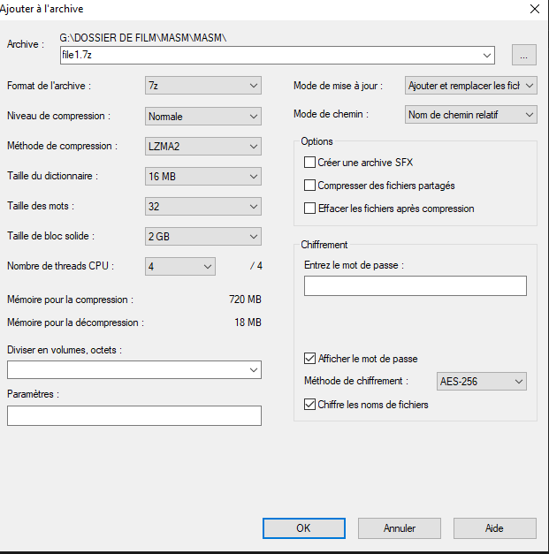

## Sommaire 

- [🎯 Présentation du projet](#presentation-du-projet)
- [📜 Introduction](#introduction)
- [👥 Membres du groupe par sprint](#membres-du-groupe-par-sprint)
- [⚙️ Choix Techniques](#choix-techniques)
- [🧗Difficultés rencontrées](#difficultes-rencontrees)
- [💡 Solutions trouvées](#solutions-trouvees)
- [🚀 Améliorations possibles](#ameliorations-possibles)

# 🎯 Présentation du projet

# Projet 1 Audit de robustesse de mots de passe

#### Présentation

Ce projet vise à mettre en place deux méthodologies de récupération,sur un réseau local, de fichiers compressés sur deux machines, une en Os Windows 11 et l'autre en Windows serveur 2022. 
Une méthode en interface graphique Ubuntu (24.04) et l'autre en CLI sur Debian .
#### Détail de la tâche principale :
Le logiciel John the Ripper est installé sur un client Linux
_Utilisation d’attaque par force brut et par dictionnaire_
Le logiciel Hashcat est installé sur un serveur Linux
 _Utilisation de masques d’attaque_ 
Les fichiers cibles sont :
“fichier1.zip” mis sur un client Windows
“fichier2.zip” mis sur un serveur Windows

#### Détail de la tâche secondaire :
Effectuer des attaques sur le mot de passe d’un compte local du serveur Windows

 
# 🎯 Objectifs

### Ligne de Défense
Les mots de passe constituent une ligne de défense contre les attaques de données informatiques à l'intérieur d'un réseau local.
Ce n'est pas la seule , VPN, Pare feu etc.. protègent nos réseaux .
### l'Audit : évaluation

Le rôle de cet audit va donc être d'évaluer la robustesse des mots de passe utilisés sur les fichiers utilisateurs du parc informatique .

Pour cela nous sommes équipé de deux machines virtuelles pouvant générer des listes de mots de passe grâçe à deux logiciels : **John the ripper et Haschcat**.

Nous sommes dans le "mode" **boite blanche** 
- Le mode boîte blanche (white box) consiste à faciliter les phases de reconnaissance et d’authentification (architecture de sécurité, compte utilisateur, accès aux serveurs, etc.) pour effectuer des tests permettant de déterminer les faiblesses du système.

 il existe deux autres modes de test :
 
 - Dans le "mode" **boîte grise** (grey box), l’auditeur a en sa possession un compte utilisateur (identifiants et mots de passe) fourni par l’entreprise. À partir de ce point, le test d’intrusion consiste à récolter des informations confidentielles pour déceler les failles de sécurité. Ce mode est apprécié pour sa rapidité à tester les différents types d’attaques internes ou externes.
 - Le "mode" **boîte noire** (black box) où aucun accès aux données n’a été fourni à l’auditeur. Pour simuler des intrusions et trouver les points vulnérables, l’expert sécurité scanne toutes les adresses IP des systèmes informatiques. L’objectif étant de trouver les identifiants d’un directeur des systèmes informatiques (DSI) ou tout autre responsable pour obtenir des autorisations et recueillir des données sensibles.

### l'Audit : recommandations

La vérification des mots de passe révèle que de nombreux collaborateurs privilégient la simplicité à la sécurité, créant des points d’entrée pour les cyberattaques.
Si les mots de passes utilisés ne sont pas assez solides, nos deux méthodes d'attaques vont les récupérer rapidement.
Cette approche permet d'examiner les mots de passe existants et de proposer des recommandations pour renforcer la sécurité des données.

# 📜 Introduction

# 👥 Membres du groupe par sprint

## **Sprint 1**

|  Franck Paisant  |     PO     | Dialogue avec dominique /mise en place du logiciel  Hashcat/                |
| :--------------: | :--------: | --------------------------------------------------------------------------- |
| Frederick flavil |     SM     | Création du tableau Trello/mise en place du logiciel John the Ripper/       |
|  Renaud Michel   | Technicien | rédaction du fichier Readme/ recherche sur le chiffrement des mots de passe |

Franck notre PO ( product owner) a bien cerné le projet et les incertitudes du débuts ont été levées après plusieurs discussions avec Dominique notamment sur le rôle un peu flou de chaque machine au début.
Frederick notre SM( srum master ) en organiseur force tranquille  nous a bien installé et guidé dans nos rôle à chacun .
Le  rôle de Renaud notre tec a été de faire des recherches sur le chiffrement des mots de passe. 
En partant de logiciel de compression et de protection , il a fait des recherches sur les manières de gérer les mots de passe de leurs créations à leurs sauvegardes .
Franck et Fréderick se sont penchés sur la mise en place d'outils permettants l'analyse de la protection des données .

---

##  **Sprint 2**

| Membre           | Rôle       | Missions                                                       |
| ---------------- | ---------- | -------------------------------------------------------------- |
| Franck Paisant   | Technicien | Finalisation de la doc et du user guide de John  the Ripper    |
| Frederick flavil | SM         | Mise en place et protocole d'attaque avec Hashcat              |
| Renaud Michel    | PO         | Test solution logicielle mise en place par Franck et Frederick |

Cette deuxième semaine de projet va nous permettre de finaliser l'attaque avec le logiciel john the Ripper, nous avons tous mis en place le dispositif établi par Franck et nous avons réussi le cassage du hash pour des mots de passe simple .Avec l'utilisation du logiciel 7 zip nous avons convenu de protéger les deux fichiers en type .zip et chiffrage en AES 256.
John the ripper , lorsqu'il visualise le fichier .zip reconnait les caractéristiques de ces protections et nous propose de les utiliser en option . Son utilisation est plutôt simple une fois le fichier récupéré et le hash sorti.

---

# ⚙️ Choix techniques

## **Matériel**

Pour effectuer ce projet, nous avons 4 machines virtuelles connectées entre elle sur un réseau local 172.16.10.0/24. leurs pare feu sont désactivés.

Une machine sous Windows serveur "SRVWIN01"  ip local:172.16.10.5  équipé en 7zip,Semba,OpenSSh.

Une machine sous Windows 11" WIN01" ip local 172.16.10.10 équipé en 7zip,Semba,OpenSSh.

Une machine sous Ubuntu" UBU01" ip local 172.16.10.20 equipé en John the Ripper, Semba, 7zip.

Une machine sous Linux Debian "SRVLX01" ip local 172.16.10.6 équipé en logiciel Hashcat, OpenSSh, 7zip.

## **Logiciel** 

**7-Zip** ( v25.0.1) est un logiciel gratuit d'archivage de fichiers avec un taux de compression très élevéet une possibilité de protection renforcée. C'est un logiciel **open source**. La plupart du code est sous licence **GNU LGPL**. Vous pouvez utiliser 7-Zip sur n'importe quel ordinateur, y compris dans les organisations commerciales. Il n'est pas nécessaire de s'enregistrer ou payer pour utiliser 7-Zip.
photo 7 zip

**John the Ripper** (v1.9.0) (ou _JTR_, ou _John_) est un [logiciel libre](https://fr.wikipedia.org/wiki/Logiciel_libre "Logiciel libre"), utilisé notamment pour tester la sécurité d'un mot de passe ([audit](https://fr.wikipedia.org/wiki/Audit_informatique "Audit informatique"), [crack](https://fr.wikipedia.org/wiki/Crack_\(informatique\) "Crack (informatique)")). D'abord développé pour tourner sous les systèmes dérivés d'UNIX, le programme fonctionne aujourd'hui sous une cinquantaine de plates-formes différentes, telles que [BeOS](https://fr.wikipedia.org/wiki/BeOS "BeOS"), [BSD](https://fr.wikipedia.org/wiki/Berkeley_Software_Distribution "Berkeley Software Distribution") et ses dérivés, [DOS](https://fr.wikipedia.org/wiki/DOS "DOS"), [Linux](https://fr.wikipedia.org/wiki/Linux "Linux"), [OpenVMS](https://fr.wikipedia.org/wiki/OpenVMS "OpenVMS"), [Win32](https://fr.wikipedia.org/wiki/Microsoft_Windows "Microsoft Windows")…
Il est  conçu pour casser des mots de passe, c’est-à-dire retrouver le mot de passe original à partir de son empreinte (ou _hash_). Il fonctionne en testant rapidement des milliers, voire des millions de combinaisons, grâce à différentes techniques comme les attaques par dictionnaire ou force brute.

.photo : icone_John_The_Ripper

**Hashcat** ( v7.0.0) est l'utilitaire de récupération de mots de passe le plus rapide et le plus avancé au monde. Il prend en charge cinq modes d'attaque uniques pour plus de 300 algorithmes de hachage hautement optimisés. hashcat est compatible avec les processeurs, les cartes graphiques et autres accélérateurs matériels sous Linux, Windows et macOS, et offre des fonctionnalités facilitant le craquage de mots de passe distribué.
Hashcat est distribué sous licence MIT. 
Le logiciel Hashcat est installé sur un serveur Linux Debian
le logiciel Semba pour permettre à UBU01 de récupérer le file1.zip sur WIN 01.

photo Hashcat
# 🧗 Difficultés rencontrées

## *John the ripper* 

problème 1 -Pour une attaque par dictionnaire la liste original de *John* est trop limité et il faut avoir des listes de mots de dictionnaire plus conséquentes.

problème 2 -Communication entre le PC client Linux et le PC client et serveur Windows

Problème 3 -Le point de montage sur le PC cible nous a amené vers une solution que s'avèrerait peu efficace et peu pratique  si nous avions à monter plus de deux machines car nous montons le serveur SERWIN01 dans le dossier ou nous avons monté le client WIN01. c'est fonctionnel mais à améliorer : _cd /mnt/Commun/win01/svrwin01 / machine 3 /machine 4..._

Problème 4 -le point de montage se perd à chaque extinction de la machine 

# 💡 Solutions trouvées
 
## *John the ripper* 

probleme 1 -téléchargement d'une wordlist plus conséquentes pour que l'attaque soit plus efficace.

probleme 2 -Installation de Samba et de cifs sur pc client Linux, création du fichier /etc/smb-partage-creds pour mémoriser mot de passe user 
Problème 3 ---voir améliorations possibles--

Problème 4 -Montage automatique au démarrage avec la modification du fichier fstab .

# 🚀 Améliorations possibles

## *John the ripper* 

Problème 3 -Modification du chemin et création d'un dossier commun"XX" par machine à monter pour éviter que les dossiers s'enchainent en cascade . 
