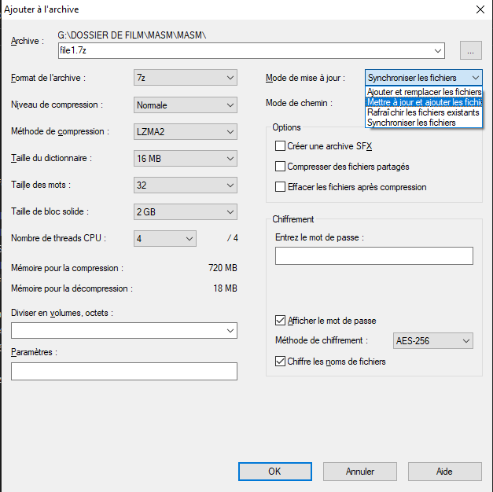

## Sommaire

1. [Utilisation de base](#utilisation-de-base)
2. [Archive protegée sous Windows ( 10/11/Serveur)](#utilisation-avancee)
3. [Utilisation avancée](#utilisation-avancee)
4. [FAQ](#faq)

# 1. Utilisation de base

Pour une utilisation sans chiffrement, il est possible de créer une archive d'un dossier ou d'un fichier avec la possibilité de compresser ces données et de diminuer son poids .
## 1.1 Faire une archive 

Clic droit sur l'objet à compresser choisissant **7-Zip → Ajouter à l’archive…**.
Dans la fenêtre qui s’ouvre, sélectionne le **format ZIP** si tu veux que ton archive soit compatible partout, ou **7z** si tu préfères une meilleure compression et laisse la case mot de passe vide.
Laisse le **niveau de compression** sur _Normal_, la **méthode de compression** sur _LZMA_ et le **mode de mise à jour** sur _Ajouter et remplacer les fichiers_.  

## 1.2 Extraire une archive

-Clic droit sur l'archive
-choisis **Extraire ici** pour tout décompresser dans le dossier actuel, ou **Extraire vers "Nom_du_dossier"** pour créer un dossier dédié.
Pour mettre à jour une archive existante, relance la commande **Ajouter à l’archive…** depuis le dossier d’origine et garde le mode _Ajouter et remplacer les fichiers_.
Ppour ouvrir une archive avec **7-Zip → Ouvrir l’archive** pour en afficher le contenu, tester son intégrité ou supprimer certains fichiers sans tout extraire.

![[extraire_le _zip.jpg]](Ressources/extraire_le _zip.jpg)

---

# 2. Archive protégée sous Windows ( 10/11/Serveur)

**Le système de chiffrement de 7-Zip protège les documents sensibles contre tout accès non autorisé** . Le contenu des fichiers à protéger est chiffré à l'aide d'un mot de passe que vous définissez.

### 2.1 créer le .zip

1. Clique droit sur ton dossier
2. **7-Zip → Ajouter à l’archive…**
3. Dans la fenêtre : 
![[formatzip.jpg]]

4. Laisse les différentes options sur" défauts" et choisis le format de l'archive et la méthode de chiffrement  : _( la plus sure actuellement est l'AES 256)_

**Format de l’archive :** zip 
**Méthode de chiffrement :** `AES-256`  

Pour le format zip proposé dans le menu , tu peux choisir ZipCrypto ou AES 256 ( mais ZipCrypto est moins secure ) par contre ZipCrypto crée une archive compatible avec la plupart des applications d'archivage.

%% *il est possible aussi de chiffrer les noms de fichiers dans l'archive.*
*Si vous devez partager ce fichier avec un collaborateur, vous devrez lui faire parvenir le mot de passe par un moyen sécurisé.* 
 %%
Puis il te faut générer ton mot de passe , l'entrer et le confirmer. ( par exemple sur le site de la CNIL )

		# Genère un mot de passe solide sur le site de la CNIL : 

		https://www.cnil.fr/fr/generer-un-mot-de-passe-solide

 
 ![[CNIL.png]](Ressources/CNIL.png)
 
 Entre le mot de passe que tu viens de ** genérer**

Clique **OK**

_Le fichier obtenu sera bien un **.zip chiffré**, compatible avec Windows ._

### 2.2 Ouvrir le .zip .
Clic droit sur le fichier .zip à ouvrir
parcourir la liste et descendre jusqu'a 7.zip
Entre le mot de passe 
clique sur Ok  

![[ouvrir_zip.png]]

![[ouvrir zip.png]

---

# 3.Utilisation avancée

## 3.1 Remarques sur la compression  

Nous avons vu dans la partie _utilisation de base_ que outre la création d'un mot de passe de l'archive , 7.zip est aussi un outil pour compresser en taille les fichiers.
il applique plusieurs méthodes dont voici le résumé en anglais
il est donc possible de choisir et de régler le taux de compression ( ratio) .

| Method    | Description                                                                                                                                                                                       |
| --------- | ------------------------------------------------------------------------------------------------------------------------------------------------------------------------------------------------- |
| LZMA      | Version améliorée et optimisée de l'algorithme LZ77.                                                                                                                                              |
| LZMA2     | Version améliorée de LZMA.                                                                                                                                                                        |
| PPMd      | Méthode PPMdH de Dmitry Shkarin avec de petits changements.                                                                                                                                       |
| BZip2     | Algorithme BWT standard.                                                                                                                                                                          |

**LZMA** est la méthode de compression générale par défaut du format **7z**.  
Ses principales caractéristiques sont :

- Taux de compression élevé.
- Taille du dictionnaire variable (jusqu'à 4 Go).
- Vitesse de compression : environ 2-8 Mo/s sur un processeur à 4 GHz.
- Vitesse de décompression : environ 30-100 Mo/s sur un processeur à 4 GHz.
- Faible demande de mémoire pour la décompression (selon la taille du dictionnaire).
- Petite taille du code de décompression : environ 5 Ko.

## 3.2 Options de metadonnées de l'archive :

- L’option **« Mode de mise à jour »** (quand tu ajoutes des fichiers à une archive existante) contrôle **ce que le programme fait avec les fichiers déjà présents dans l’archive**.  Autrement dit, cela définit **comment 7-Zip met à jour ou remplace les fichiers** d’une archive .7z, .zip, etc.

Voici les différents modes possibles :

| Mode de mise à jour                                                   | Description                                                                                                                                                                            |
| :-------------------------------------------------------------------- | :------------------------------------------------------------------------------------------------------------------------------------------------------------------------------------- |
| **Ajouter et remplacer les fichiers** _(Add and replace files)_       | Ajoute les nouveaux fichiers et remplace ceux déjà présents dans l’archive s’ils portent le même nom. → C’est le mode le plus courant.                                                 |
| **Mettre à jour les fichiers** _(Update files)_                       | Remplace uniquement les fichiers **plus anciens** dans l’archive (comparaison par date). Si le fichier du disque est plus récent, il est mis à jour. Sinon, il est laissé tel quel.    |
| **Actualiser (Synchroniser) les fichiers** _(Freshen existing files)_ | Ne remplace que les fichiers **déjà présents** dans l’archive, et uniquement s’ils sont plus récents sur le disque. Aucun nouveau fichier n’est ajouté.                                |
| **Remplacer les fichiers** _(Synchronize archive contents)_           | Supprime de l’archive tout fichier qui n’existe plus dans le dossier source et met à jour le reste. En gros, cela rend l’archive **identique** au dossier d’origine (synchronisation). |
| **Ignorer les fichiers existants** _(Skip existing files)_            | Ajoute seulement les nouveaux fichiers, sans modifier ni remplacer ceux qui sont déjà dans l’archive.                                                                                  |

- L’option **« Format de l'archive»** détermine **le type de fichier compressé à créer** — c’est-à-dire **la structure et les capacités** de l’archive (vitesse, taux de compression, chiffrement, compatibilité, etc.).

![[differents_format_archives.jpg]]!

Par défaut, 7-Zip ne garde **que la date de modification**, donc la date de dernière modification est préservée **mais** la date de création et celle du dernier accès sont perdues.
C’est un **problème en archivage technique ou légal**, où la date de création ou d’accès à une valeur est  importante.
exemple :
- Sauvegardes système ou serveur
- Archivage réglementaire
- Restauration complète d’environnement (avec hard links, symlinks, ACL) 

---

# 4 . FAQ

## Q : quels sont les différents formats d'archives ?

L’option **« Format de l'archive»** détermine **le type de fichier compressé à créer** — c’est-à-dire **la structure et les capacités** de l’archive (vitesse, taux de compression, chiffrement, compatibilité, etc.).
(Ressources/format_archive.png)
![[differents_format_archives.jpg]]
Par défaut, 7-Zip ne garde **que la date de modification**, donc la date de dernière modification est préservée **mais** la date de création et celle du dernier accès sont perdues.
C’est un **problème en archivage technique ou légal**, où la date de création ou d’accès à une valeur est  importante.
exemple :
- Sauvegardes système ou serveur
- Archivage réglementaire
- Restauration complète d’environnement (avec hard links, symlinks, ACL) 
- 
### Q : qu'est ce qu'une Archive wim ?

![[wim.jpg]]

les options de format TAR / WIM  permettent d’enregistrer aussi les liens symboliques, liens physiques, ACL (Access Control List), NTFS(système de fichiers des systèmes Windows). 

## 4.2 Chiffrement

7-Zip supporte aussi le chiffrement au moyen de l'algorithme AES-256. 

Cet algorithme utilise une clé de chiffrement d'une longueur de 256 bits. 

Pour créer cette clé, 7-Zip utilise des fonctions de dérivation basées sur l'algorithme de hachage SHA-256. 

La fonction de dérivation produit une clé dérivée du texte fourni par l'utilisateur. 
Pour augmenter le coût d'une recherche exhaustive du mot de passe, 7-zip utilise un grand nombre d'itérations pour produire la clé chiffrée à partir du mot de passe.
