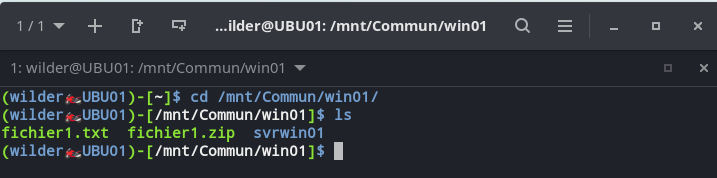
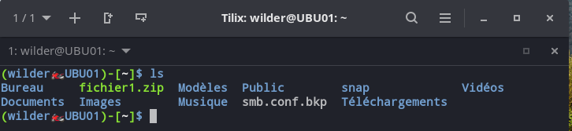
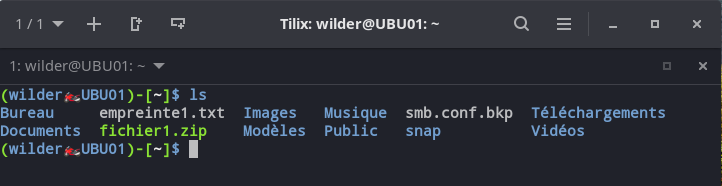
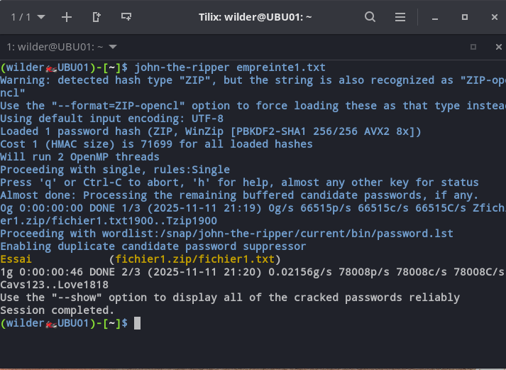
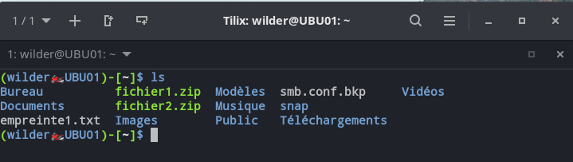
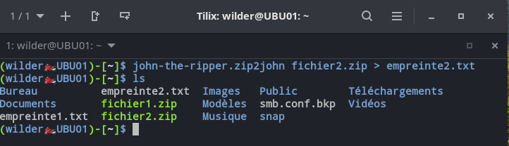
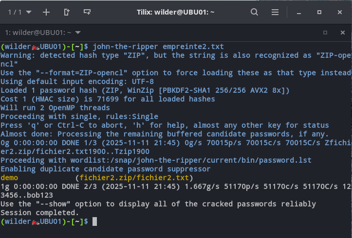

## Sommaire

1. [Utilisation de base](#utilisation-de-base)
2. [Utilisation avancée](#utilisation-avancee)
3. [FAQ](#faq)

# 1. Utilisation de base

### Fichier1.zip

Une fois le logiciel *John the ripper* installé sur notre machine, voici la procédure pour récupérer le fichier et lancer notre logiciel sur notre fichier  compressé protéger par un mot de passe :

- On se déplace dans notre dossier commun pour accéder au fichiers qui nous intéresse :

Pour se rendre sur notre **fichier1.zip** , voici la commande :

```
cd /mnt/Commun/win01/
```

et ensuite la commande avec la commande **ls** :



- On va copier le **fichier1.zip** dans notre répertoire **/home/wilder**

```
cp fichier1.zip /home/wilder
```
<span id="utilisation-de-base"></span>




- Maintenant nous allons commencer par récupérer le **HASH** de notre fichier par cette commande:

```
john-the-ripper.zip2john fichier1.zip > empreinte1.txt
```

- Ensuite comme vous pouvez le voir sur cette *screenshot* nous avons un fichier **empreinte1.txt** de créé avec le *hash*




- Grâce à ce fichier nous allons pouvoir lancer *John* pour nous casser le mot de passe par force brut avec cette commande :

```
john-the-ripper empreinte1.txt
```

Et voici le résultat tant attendu :



Opération réussi comme vous pouvez voir le mot de passe était : **Essai**

### Fichier2.zip

- Place au deuxième fichier cela va ressemblér au fichier 1 sauf que le chemin est différent :
- On se rend au bonne endroit et on copie le fichier sur le **/home/wilder**

```
cd /mnt/Commun/win01/svrwin01
cp fichier2.zip /home/wilder
```



- Récupérons le *HASH* :

```
john-the-ripper.zip2john fichier2.zip > empreinte2.txt
```




- Et maintenant on envoi la commande de l'attaque de *John*

```
john-the-ripper empreinte2.txt
```




Et voilà le Mot de Passe de *fichier2.zip* était **demo**


# 2. Utilisation avancée
<span id="utilisation-avancee"></span>
- On peut aussi faire avec des options comme avec une liste de mdp spécifique :

```
john-the-ripper -wordlist=/home/wilder/Documents/000webhost.txt empreinte1.txt
```

Où avec la liste *rockyou* que l'on a vu dans la partie **INSTALL**

```
john-the-ripper -wordlist=/home/wilder/Documents/rockyou.txt empreinte1.txt
```


# 3. FAQ
<span id="faq"></span>
